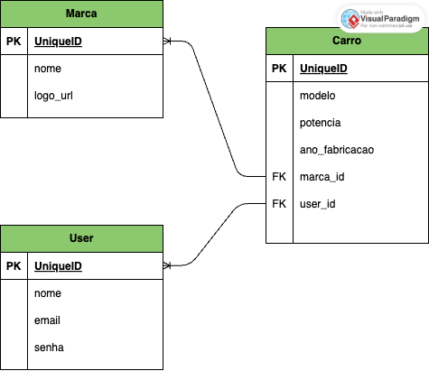
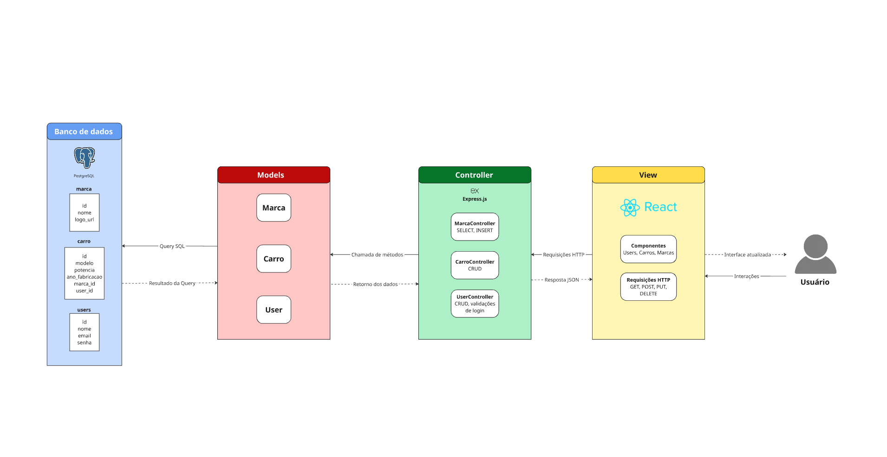

# Web Application Document - Projeto Individual - Módulo 2 - Inteli

## Garagem dos sonhos

#### Pedro Siqueira de Souza

## 1. Introdução
&ensp; Este documento descreve a implementação de um sistema web para adição de informações sobre carros dos usuários. A aplicação permitirá que usuários cadastrados incluam, visualizem, atualizem e removam dados sobre os carros adicionados na apliacação. O sistema foi projetado para que os usuários mostrem seus carros para outros usuários intusiastas do tema em cards dentro de seu perfil, sendo uma plataforma intuitiva e de fácil utilização.

## 2. Projeto da Aplicação Web
### 2.1 Diagrama do banco de dados

Figura X - Diagrama do banco de dados

Fonte: Material produzido pelos autores (2025)

&ensp;O banco de dados é composto por três tabelas principais:

1. **User** - Armazena informações dos usuários cadastrados
   - UniqueID (PK): UUID - Identificador único do usuário
   - nome: VARCHAR(100) - Nome completo do usuário
   - email: VARCHAR(100) - Endereço de email para login
   - senha: VARCHAR(255) - Senha de acesso.

2. **Marca** - Registra as marcas de carros disponíveis
   - UniqueID (PK): UUID - Identificador único da marca
   - nome: VARCHAR(50) - Nome da marca (ex: Toyota, Ford, BMW)
   - logo_url: VARCHAR(255) - URL para a imagem do logotipo da marca

3. **Carro** - Contém as informações específicas de cada modelo de carro
   - UniqueID (PK): UUID - Identificador único do carro
   - modelo: VARCHAR(100) - Nome/modelo do carro
   - potencia: INT - Potência do motor (em cavalos)
   - ano_fabricacao: INT - Ano em que o carro foi fabricado
   - marca_id (FK): UUID - Referência ao ID da marca do carro
   - user_id (FK): UUID - Referência ao ID do usuário que cadastrou o carro

### 2.2 Models 
&ensp;O sistema web implementa três models principais que representam as entidades do domínio e gerenciam a interação com o banco de dados PostgreSQL:
#### Model User
O model User representa os usuários do sistema e possui os seguintes atributos:

- **id:** Identificador único do usuário
- **nome:** Nome completo do usuário
- **email:** Endereço de email (usado para autenticação)
- **senha:** Senha do usuário 

##### Funcionalidades implementadas:

`findAll()`: Busca todos os usuários cadastrados
`findById(id)`: Busca um usuário específico pelo ID
`findByEmail(email)`: Busca um usuário pelo email (usado na autenticação)
`create(userData)`: Cria um novo usuário no sistema
`update(id, userData)`: Atualiza os dados de um usuário existente
`delete(id)`: Remove um usuário do sistema

### Model Marca
&ensp; O model Marca representa as marcas de veículos disponíveis no sistema e possui os seguintes atributos:

- **id:** Identificador único da marca
- **nome:** Nome da marca
- **logo_url:** URL da imagem da logo da marca

#### Funcionalidades implementadas:

`findAll()`: Busca todas as marcas cadastradas, ordenadas por nome
`findById(id)`: Busca uma marca específica pelo ID
`create(marcaData)`: Cadastra uma nova marca no sistema

### Model Carro
&ensp;O model Carro representa os veículos cadastrados pelos usuários e possui os seguintes atributos:

- **id:** Identificador único do carro
- **modelo:** Modelo do veículo
- **potencia:** Potência do motor do veículo
- **ano_fabricacao:** Ano de fabricação do veículo
- **marca_id:** Chave estrangeira referenciando a marca do veículo
- **user_id:** Chave estrangeira referenciando o proprietário do veículo
- **marca_nome:** Nome da marca 
- **marca_logo:** URL do logo da marca 

#### Funcionalidades implementadas:

`findAll()`: Busca todos os carros com informações da marca 
`findById(id)`: Busca um carro específico pelo ID com dados da marca
`findByUserId(userId)`: Busca todos os carros de um usuário específico
`create(carroData)`: Cadastra um novo carro no sistema
`update(id, carroData)`: Atualiza os dados de um carro existente
`delete(id)`: Remove um carro do sistema

### 2.3 Arquitetura
&ensp;Este diagrama descreve a arquitetura de uma aplicação web para gerenciamento de usuários e carros, baseada no padrão MVC e utilizando React para o front-end, Node.js e Express para o back-end e PostgreSQL como banco de dados.

Figura X - Arquitetura do projeto

Fonte: Material produzido pelos autores (2025)

#### View 

&ensp;A camada de visualização utiliza React.js como tecnologia. Essa camada é responsável por renderizar a interface interativa, que permite a visualização e manipulação dos dados de usuários, carros e marcas. Além disso, o frontend realiza requisições HTTP para o backend e atualiza a interface de acordo com as respostas recebidas, proporcionando uma experiência dinâmica e responsiva para o usuário.

#### Controller

&ensp; A camada de controle foi implementada com Express.js e atua como intermediária entre o frontend e a camada de modelo. Essa camada processa e valida os dados recebidos nas requisições, executa a lógica de negócio necessária e aciona os métodos dos modelos. As respostas são devolvidas no formato JSON, acompanhadas de códigos de status HTTP apropriados. 

&ensp; Foram criados três controllers principais: o UserController, que gerencia o CRUD de usuários e autenticação, o CarroController, responsável por operações relacionadas a veículos, e o MarcaController, que administra as informações das marcas de carros.

#### Model

&ensp; A camada de modelo é o núcleo da lógica de negócio e da persistência de dados no sistema. Nela, são definidas as estruturas de dados e as regras de negócio. Os modelos implementados são o User Model, que gerencia dados de usuários e autenticação, o Carro Model, que lida com as informações dos veículos e seus relacionamentos com usuários e marcas, e o Marca Model, que armazena os dados das marcas. No banco de dados, os relacionamentos são bem definidos: cada carro pertence a uma marca e a um usuário, estabelecendo relações N:1 entre as tabelas.

&ensp; **Legenda do Diagrama:** No diagrama de arquitetura, as setas não-pontilhadas representam o fluxo de requisições e as setas pontilhadas indicam o fluxo de respostas que retornam com os dados processados.
