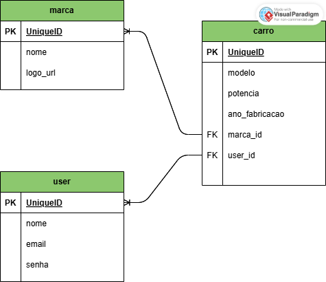

# Web Application Document (WAD) - Garagem dos sonhos

## Pedro Siqueira de Souza

## 1. Introdução
&ensp; Este documento descreve a implementação de um sistema web para adição de informações sobre carros dos usuários. A aplicação permitirá que usuários cadastrados incluam, visualizem, atualizem e removam dados sobre os carros adicionados na apliacação. O sistema foi projetado para que os usuários mostrem seus carros para outros usuários intusiastas do tema em cards dentro de seu perfil, sendo uma plataforma intuitiva e de fácil utilização.

## 2. Diagrama do banco de dados

Figura X - Diagrama do banco de dados

Fonte: Material produzido pelos autores (2025)

O banco de dados é composto por três tabelas principais:

1. **User** - Armazena informações dos usuários cadastrados
   - UniqueID (PK): UUID - Identificador único do usuário
   - nome: VARCHAR(100) - Nome completo do usuário
   - email: VARCHAR(100) - Endereço de email para login
   - senha: VARCHAR(255) - Senha de acesso.

2. **Marca** - Registra as marcas de carros disponíveis
   - UniqueID (PK): UUID - Identificador único da marca
   - nome: VARCHAR(50) - Nome da marca (ex: Toyota, Ford, BMW)
   - logo_url: VARCHAR(255) - URL para a imagem do logotipo da marca

3. **Carro** - Contém as informações específicas de cada modelo de carro
   - UniqueID (PK): UUID - Identificador único do carro
   - modelo: VARCHAR(100) - Nome/modelo do carro
   - potencia: INT - Potência do motor (em cavalos)
   - ano_fabricacao: INT - Ano em que o carro foi fabricado
   - marca_id (FK): UUID - Referência ao ID da marca do carro
   - user_id (FK): UUID - Referência ao ID do usuário que cadastrou o carro